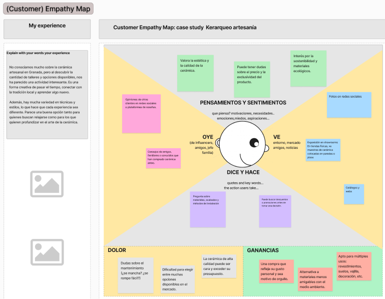
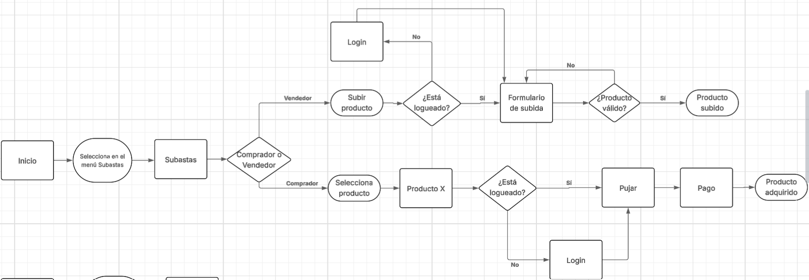
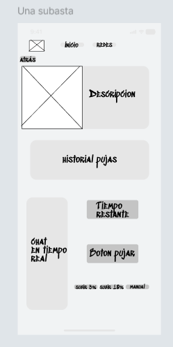

# DIU25
Prácticas Diseño Interfaces de Usuario (Tema: Reciclaje y artesanía (handcraft) ) 

[Guiones de prácticas](GuionesPracticas/)

Grupo: DIU3.CarlonsoTech  Curso: 2024/25 

Actualizado: 25/03/2025

Proyecto: ArqueoBid

>>> Decida el nombre corto de su propuesta en la práctica 2

El proyecto ArqueoBid añadirá un sistema de subastas a Kerarqueo, permitiendo a compradores pujar por piezas arqueológicas y a vendedores gestionarlas. La propuesta optimiza la navegación y accesibilidad, facilitando subastas en tiempo real y mejorando la experiencia de compra-venta. Con esta iniciativa, se busca fomentar la difusión y preservación del patrimonio arqueológico en un entorno digital especializado.

Logotipo: 

>>> Si diseña un logotipo para su producto en la práctica 3 pongalo aqui, a un tamaño adecuado. Si diseña un slogan añadalo aquí

Miembros:
 * :bust_in_silhouette:  Carlos Guasp López     :octocat:     
 * :bust_in_silhouette:  Alfonso Maldonado Herrero     :octocat:

>>> Los equipos son de 2 personas. Identifícaros con el nombre del Grupo y los enlaces a los perfiles de GitHub de cada integrante

----- 

>>> Este documento es el esqueleto del Case Study que explica el proceso de desarrollo de las 5 prácticas de DIU. Aparte de subir cada entrega a PRADO, se debe actualizar y dar formato de informe final a este documento online. Elimine este tipo de texto / comentarios desde la práctica 1 conforme proceda a cada paso

# Proceso de Diseño 

 

## Paso 1. UX User & Desk Research & Analisis 

>>> Cualquier título puede ser adaptado. Recuerda borrar estos comentarios del template en tu documento

### 1.a User Reseach Plan
 
-----

Kerarqueo es una plataforma digital dedicada a la comercialización de productos artesanales sostenibles y reciclados. En este estudio, se analizará su usabilidad para mejorar la experiencia del usuario y optimizar la interacción con la plataforma. La evaluación se realizará comparando Kerarqueo con sitios similares como Etsy y Amazon Handmade, identificando oportunidades de mejora en navegación, accesibilidad y proceso de compra.
El estudio se enfocará en dos perfiles de usuario: compradores interesados en productos sostenibles e interesados en aprender mediante algún curso. Para comprender mejor sus necesidades, se emplearán métodos de investigación cualitativa y cuantitativa, como entrevistas, encuestas y análisis de comportamiento del usuario. También se evaluará la accesibilidad en distintos dispositivos y navegadores.
La estrategia de análisis combinará observación directa, pruebas de usabilidad con usuarios reales y una evaluación heurística basada en los principios de Nielsen. Con este enfoque, se espera identificar problemas clave y proponer mejoras prácticas para optimizar la plataforma, aumentar la satisfacción del usuario y validar suposiciones de diseño con datos reales.

Para evaluar la usabilidad y la experiencia de usuario de Kerarqueo, se ha realizado un análisis comparativo con dos plataformas similares: Etsy y Amazon Handmade. Ambas ofrecen productos artesanales y cuentan con una base sólida de usuarios, por lo que sirven como referencia para detectar oportunidades de mejora en Kerarqueo.

>>> Describe el plan en tu User Research (cómo se plantea la selección de usuarios). Borra esta línea cuando lo tengas.  

### 1.b Competitive Analysis
 
-----

Se ha seleccionado Kerarqueo, una plataforma dedicada a la venta de productos artesanales sostenibles y reciclados. Para analizar su usabilidad y mejorar la experiencia de usuario, se ha realizado una comparación con dos plataformas similares: Etsy y Amazon Handmade. Estos competidores han sido elegidos por su relevancia en el sector y su reconocimiento en el mercado global.

**Justificación de la Elección de Kerarqueo**
Kerarqueo ha sido seleccionado debido a su enfoque en la sostenibilidad y el comercio artesanal, lo que lo diferencia de otras plataformas más generalistas como Etsy y Amazon Handmade. Su propuesta de valor está alineada con una tendencia creciente de consumidores que buscan productos hechos a mano con un impacto ambiental reducido. Esta filosofía representa una ventaja competitiva clave en un mercado donde la autenticidad y la responsabilidad social son cada vez más valoradas.

Sin embargo, en términos de usabilidad y experiencia de usuario, Kerarqueo presenta áreas de mejora significativas. Su sistema de navegación no es tan intuitivo como el de sus competidores, lo que puede dificultar la exploración y descubrimiento de productos. Además, la falta de una estructura clara en la categorización de los artículos puede afectar la accesibilidad y la facilidad de búsqueda para los usuarios.

Otro aspecto a considerar es la optimización móvil, donde Kerarqueo aún no está completamente adaptado a dispositivos móviles, lo que limita su alcance y la conversión de visitantes en compradores. Comparado con Etsy y Amazon Handmade, que han desarrollado sistemas robustos en experiencia de compra y soporte al vendedor, Kerarqueo necesita implementar mejoras estratégicas para ofrecer un servicio más competitivo y atractivo para artesanos y clientes.

>>> Describe brevemente características de las aplicaciones que tiene asignadas tu grupo. Decidete por una y explica por qué se ha seleccionado. Borra esta línea cuando lo tengas. 

### 1.c Personas
 
-----

Hemos escogido a un agricultor y a una influencer para analizar la web porque representan perfiles con necesidades, conocimientos digitales y expectativas muy distintas, lo que permite evaluar la accesibilidad y usabilidad desde perspectivas contrastadas.

>>> Junto con la captura de pantalla de la ficha de la persona, haz una breve descripción de la misma. Recuerda que son dos. Los recursos de imagen deberán estar dentro de la carpeta P1/ Cuando termines, borra esta línea.  

### 1.d User Journey Map
 
----

El estudio se centrará en dos tipos de usuarios: aquellos que buscan comprar productos sostenibles y quienes desean aprender a través de cursos. Para identificar mejor sus necesidades, se utilizarán técnicas de investigación tanto cualitativas como cuantitativas, incluyendo entrevistas, encuestas y análisis del comportamiento del usuario. Además, se analizará la accesibilidad en diferentes dispositivos y navegadores.

>>> Describe el porqué de las dos experiencias de usuario contadas en el journey map. Por ejemplo, reflexiona si te parece que son habituales. Enlaza con los recursos journey que están en la carpeta P1/. Borra esta linea del template cuando termines.  

### 1.e Usability Review
 
----

>>>  El objetivo es revisar la usabilidad del competidor seleccionado. Usamos un checklist de verificación. Tras usarlo, subelo a la carpeta P1/ Ofrece aquí un parrafo para:
>>> - Enlace al documento:  

>>> - URL y Valoración numérica obtenida: 64 - Moderate
>>> - Comentario sobre la revisión:  La web cumple con los requisitos básicos de usabilidad y accesibilidad. Aunque se han identificado algunos aspectos mejorables, estos están más relacionados con la optimización de la navegación y la personalización de la experiencia. Creemos que la incorporación de más filtros de búsqueda y un sistema de inicio de sesión más amplio ayudaría a mejorar la interacción del usuario y facilitar el acceso a los productos y cursos de manera más intuitiva.

 

## Paso 2. UX Design  

>>> Cualquier título puede ser adaptado. Recuerda borrar estos comentarios del template en tu documento

### 2.a Reframing / IDEACION: Feedback Capture Grid / EMpathy map 
 
----

>>> Comenta con un diagrama los aspectos más destacados a modo de conclusion de la práctica anterior. De qué carece la competencia?? Tu diagrama puede ser una figura subida a la carpeta P2/

 Interesante | Críticas     
| ------------- | -------
  Preguntas | Nuevas ideas
  
    
>>> Explica el Problema y plantea una hipótesis. Es decir, explica aquí qué 
>>> se plantea como "propuesta de valor" para un nuevo diseño de aplicación propio

### 2.b ScopeCanvas

----

>>> Propuesta de valor, pero ahora en vez de un texto es un ScopeCanvas que has subido a P2/ y enlazado desde aqui. Tambien vale una imagen miniatura del recurso.
>>> No olvides que tu propuesta ya tiene un nombre corto y puedes actualizar la cabecera de este archivo

El proyecto consiste en el desarrollo de una plataforma digital que mejore la experiencia y usabilidad del sitio web Kerarqueo, optimizando su interfaz y funcionalidades para facilitar el acceso a contenido arqueológico. A partir del análisis de usabilidad realizado en la Práctica 1, se han identificado áreas de mejora en la navegación, accesibilidad y presentación de la información. La propuesta busca hacer la plataforma más intuitiva, permitiendo a los usuarios explorar recursos arqueológicos de manera eficiente, interactuar con el contenido de forma más atractiva y mejorar la difusión del conocimiento en esta área.

### 2.b User Flow (task) analysis 
 
-----

>>> Definir "User Map" y "Task Flow" ... enlazar desde P2/ y describir brevemente

### 2.c IA: Sitemap + Labelling 
 
----

>>> Identificar términos para diálogo con usuario (evita el spanglish) y la arquitectura de la información. Es muy apropiado un diagrama tipo sitemap y una tabla que se ampliaría para llevar asociado la columna iconos (tanto para la web como para una app). 

Término | Significado     
| ------------- | -------
  Login  | acceder a plataforma

  

### 2.d Wireframes
 
-----

>>> Hecho con Figma

 

## Paso 3. Mi UX-Case Study (diseño)

>>> Cualquier título puede ser adaptado. Recuerda borrar estos comentarios del template en tu documento

### 3.a Moodboard

-----

>>> Diseño visual con una guía de estilos visual (moodboard) 
>>> Incluir Logotipo. Todos los recursos estarán subidos a la carpeta P3/
>>> Explique aqui la/s herramienta/s utilizada/s y el por qué de la resolución empleada. Reflexione ¿Se puede usar esta imagen como cabecera de Instagram, por ejemplo, o se necesitan otras?

### 3.b Landing Page
 
----

>>> Plantear el Landing Page del producto. Aplica estilos definidos en el moodboard

### 3.c Guidelines
 
----

>>> Estudio de Guidelines y explicación de los Patrones IU a usar 
>>> Es decir, tras documentarse, muestre las deciones tomadas sobre Patrones IU a usar para la fase siguiente de prototipado. 

### 3.d Mockup
 
----

>>> Consiste en tener un Layout en acción. Un Mockup es un prototipo HTML que permite simular tareas con estilo de IU seleccionado. Muy útil para compartir con stakeholders

### 3.e ¿My UX-Case Study?
 
-----

>>> Publicar my Case Study en Github... Es el momento de dejar este documento para que sea evaluado y calificado como parte de la práctica
>>> Documente bien la cabecera y asegurese que ha resumido los pasos realizados para el diseño de su producto

 

## Paso 4. Pruebas de Evaluación 

### 4.a Reclutamiento de usuarios 

-----

>>> Breve descripción del caso asignado (llamado Caso-B) con enlace al repositorio Github
>>> Tabla y asignación de personas ficticias (o reales) a las pruebas. Exprese las ideas de posibles situaciones conflictivas de esa persona en las propuestas evaluadas. Mínimo 4 usuarios: asigne 2 al Caso A y 2 al caso B.

| Usuarios | Sexo/Edad     | Ocupación   |  Exp.TIC    | Personalidad | Plataforma | Caso
| ------------- | -------- | ----------- | ----------- | -----------  | ---------- | ----
| User1's name  | H / 18   | Estudiante  | Media       | Introvertido | Web.       | A 
| User2's name  | H / 18   | Estudiante  | Media       | Timido       | Web        | A 
| User3's name  | M / 35   | Abogado     | Baja        | Emocional    | móvil      | B 
| User4's name  | H / 18   | Estudiante  | Media       | Racional     | Web        | B 

### 4.b Diseño de las pruebas 
 
-----

>>> Planifique qué pruebas se van a desarrollar. ¿En qué consisten? ¿Se hará uso del checklist de la P1?

### 4.c Cuestionario SUS
 
----

>>> Como uno de los test para la prueba A/B testing, usaremos el **Cuestionario SUS** que permite valorar la satisfacción de cada usuario con el diseño utilizado (casos A o B). Para calcular la valoración numérica y la etiqueta linguistica resultante usamos la [hoja de cálculo](https://github.com/mgea/DIU19/blob/master/Cuestionario%20SUS%20DIU.xlsx). Previamente conozca en qué consiste la escala SUS y cómo se interpretan sus resultados
http://usabilitygeek.com/how-to-use-the-system-usability-scale-sus-to-evaluate-the-usability-of-your-website/)
Para más información, consultar aquí sobre la [metodología SUS](https://cui.unige.ch/isi/icle-wiki/_media/ipm:test-suschapt.pdf)
>>> Adjuntar en la carpeta P4/ el excel resultante y describa aquí la valoración personal de los resultados 

### 4.d A/B Testing
 
-----

>>> Los resultados de un A/B testing con 3 pruebas y 2 casos o alternativas daría como resultado una tabla de 3 filas y 2 columnas, además de un resultado agregado global. Especifique con claridad el resultado: qué caso es más usable, A o B?

### 4.e Aplicación del método Eye Tracking 

----

>>> Indica cómo se diseña el experimento y se reclutan los usuarios. Explica la herramienta / uso de gazerecorder.com u otra similar. Aplíquese únicamente al caso B.

  
>>> Cambiar esta img por una de vuestro experimento. El recurso deberá estar subido a la carpeta P4/  

>>> gazerecorder en versión de pruebas puede estar limitada a 3 usuarios para generar mapa de calor (crédito > 0 para que funcione) 

### 4.f Usability Report de B
 
-----

>>> Añadir report de usabilidad para práctica B (la de los compañeros) aportando resultados y valoración de cada debilidad de usabilidad. 
>>> Enlazar aqui con el archivo subido a P4/ que indica qué equipo evalua a qué otro equipo.

>>> Complementad el Case Study en su Paso 4 con una Valoración personal del equipo sobre esta tarea

 

## Paso 5. Exportación y Documentación 

### 5.a Exportación a HTML/React
 
----

>>> Breve descripción de esta tarea. Las evidencias de este paso quedan subidas a P5/

### 5.b Documentación con Storybook

----

>>> Breve descripción de esta tarea. Las evidencias de este paso quedan subidas a P5/

 

## Conclusiones finales & Valoración de las prácticas

>>> Opinión FINAL del proceso de desarrollo de diseño siguiendo metodología UX y valoración (positiva /negativa) de los resultados obtenidos. ¿Qué se puede mejorar? Recuerda que este tipo de texto se debe eliminar del template que se os proporciona 

